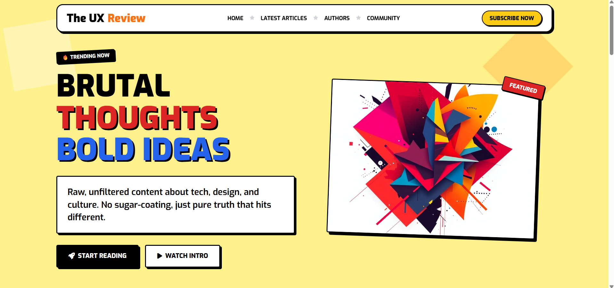
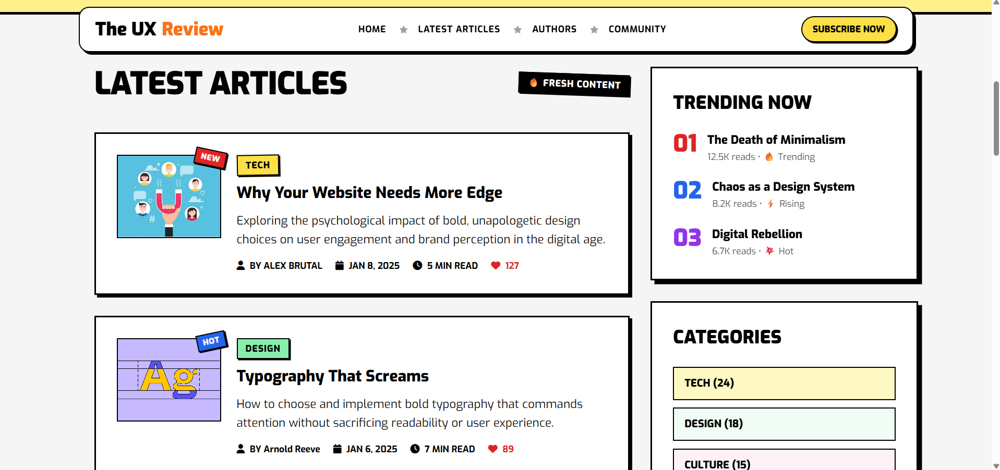
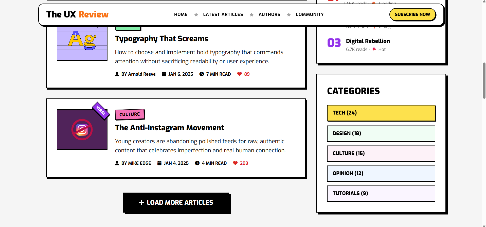
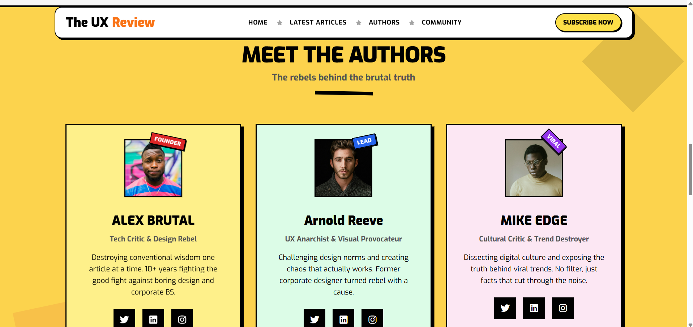
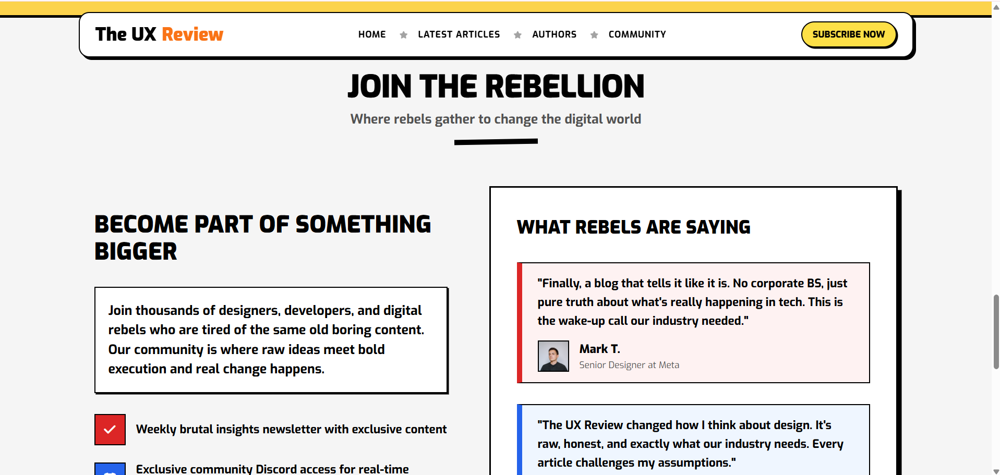
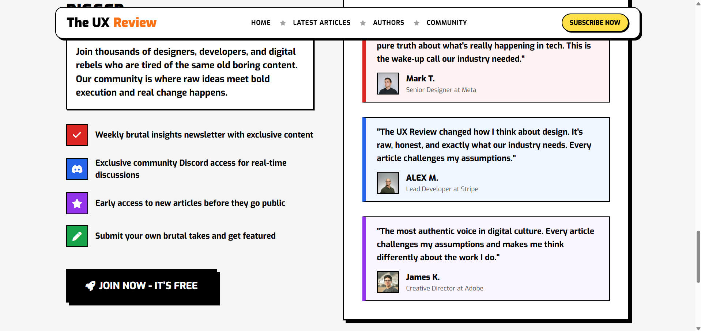
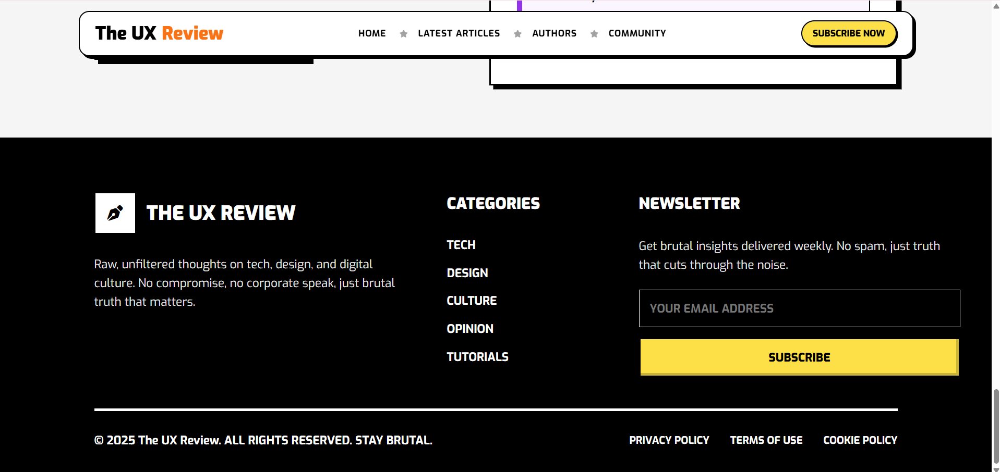
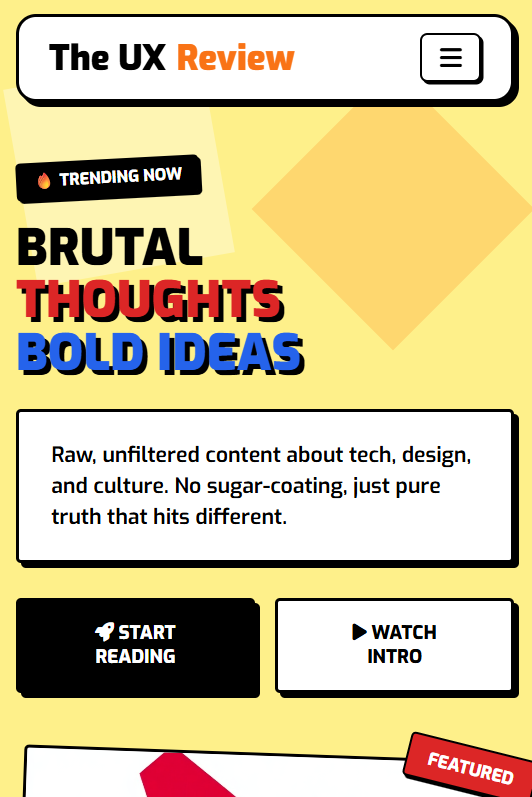
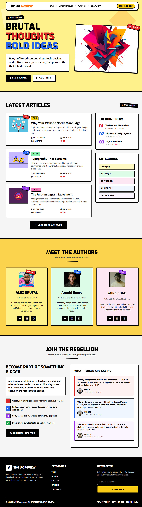

# ⚡ The UX Review Blog - Neubrutalism Landing Page

[](https://developer.mozilla.org/en-US/docs/Web/HTML)
[](https://developer.mozilla.org/en-US/docs/Web/CSS)
[](https://developer.mozilla.org/en-US/docs/Learn/CSS/CSS_layout/Flexbox)
[](https://developer.mozilla.org/en-US/docs/Learn/CSS/CSS_layout/Responsive_Design)
[](https://github.com/mariammgamall/route-frontendc49-tasks)
[](https://the-ux-review-blog.vercel.app/)

> **Modern Neubrutalist Blog Landing Page**  
> Recreating **The UX Review** blog landing page using **pure HTML5** and **beginner vanilla CSS** in a bold, trendy **Neubrutalism** visual style with standard Flexbox layouts, position properties, and responsive media queries for mobile and tablet screens as part of the **Route IT Training Center** Frontend Diploma (C49).
> 
> 🌐 **Live Demo**: [https://neubrutalism-landing-page.vercel.app/](https://neubrutalism-landing-page.vercel.app/)  
> 🔗 **GitHub Repository**: [https://github.com/mariammgamall/route-frontendc49-tasks](https://github.com/mariammgamall/route-frontendc49-tasks)

## 📸 Screenshots Showcase

### 1. Fixed Navbar & Hero Section


### 2. Latest Articles & Sticky Sidebar



### 3. Authors Section


### 4. Community & Testimonials Section



### 5. Footer & Newsletter Section


### 6. Mobile View & Pure CSS Navigation


### 7. Full Landing Page View



## ✨ Features & Highlights

- 🎨 **Neubrutalism Aesthetics**:
  - Black borders (`3px solid #000` / `2px solid #000`)
  - Hard offset box-shadows (`box-shadow: 6px 6px 0 #000`, `4px 4px 0 #000`)
  - Vivid color palette (Yellow, Red, Blue, Green, Purple, Pink)
  - Rotated elements (`transform: rotate(2deg)`, `rotate(-12deg)`, `rotate(45deg)`)
  - Text outlines & shadows (`text-shadow-white`)
  - Interactive CTA button hover animations

- 🧭 **Fixed Navbar & Flexbox Layout**:
  - `position: fixed` top navigation bar with high `z-index` stacking.
  - Interactive mobile drawer menu implemented purely using CSS `:target`.

- 📰 **Latest Articles & Sticky Sidebar**:
  - Two-column Flexbox layout (Main Content & Sidebar).
  - Article cards with side-by-side flex layout on desktop, stacked on mobile.
  - Rotated badges (`NEW`, `HOT`, `VIRAL`) and category tags.
  - `position: sticky; top: 100px;` sidebar with trending articles and category pills.

- 👥 **Authors Section**:
  - Three-column Flexbox author profile cards with background color themes.
  - Hover effects: Smooth upward shift (`transform: translateY(-6px)`) and shadow adjustments.
  - Social media links opening in a new tab (`target="_blank"`).

- 🤝 **Community & Testimonials**:
  - Benefits list with custom icon bullet points.
  - Testimonial cards with colored left accent borders (red, blue, purple).

- 📬 **Footer**:
  - Three-column layout (About, Categories, Newsletter).
  - Email subscription input form.
  - Legal links bar and copyright declaration.

## 🛠️ Built With

* **HTML5**: Semantic tags (`<header>`, `<section>`, `<article>`, `<aside>`, `<footer>`)
* **CSS3**: Vanilla CSS, Flexbox, Positioning, Responsive Media Queries (`@media`), CSS Custom Variables (`:root`)
* **FontAwesome 6**: Vector icons
* **Google Fonts**: Font family `'Exo'`

## 🚀 Getting Started

To view or work with the project locally:

1. Clone the repository:
   ```bash
   git clone https://github.com/mariammgamall/route-frontendc49-tasks.git
   ```
2. Navigate into the project folder:
   ```bash
   cd route-frontendc49-tasks/"Task 04-neubrutalism-landing-page"
   ```
3. Open `index.html` directly in any web browser.

---

## 👩‍💻 Author

Developed by **Mariam Gamal** as part of the **Route IT Training Center** Frontend Diploma (C49).

