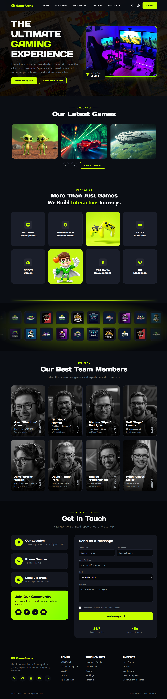
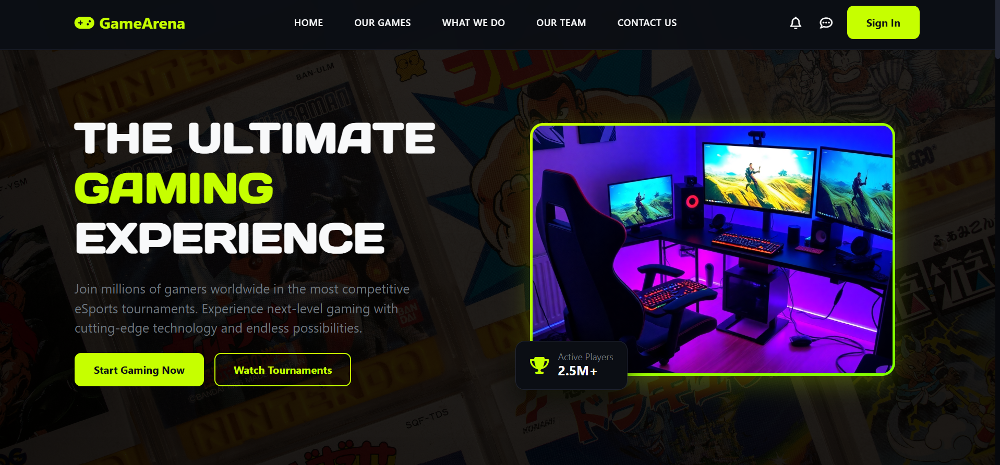
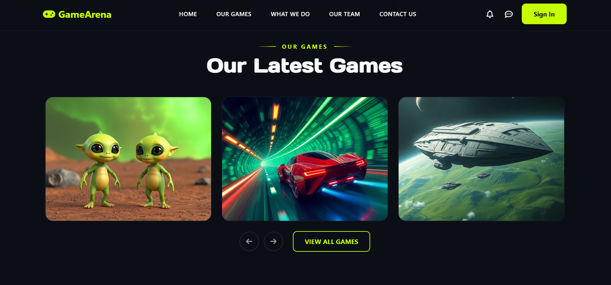
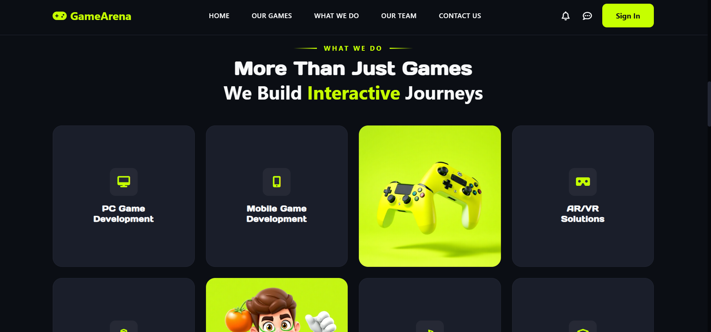
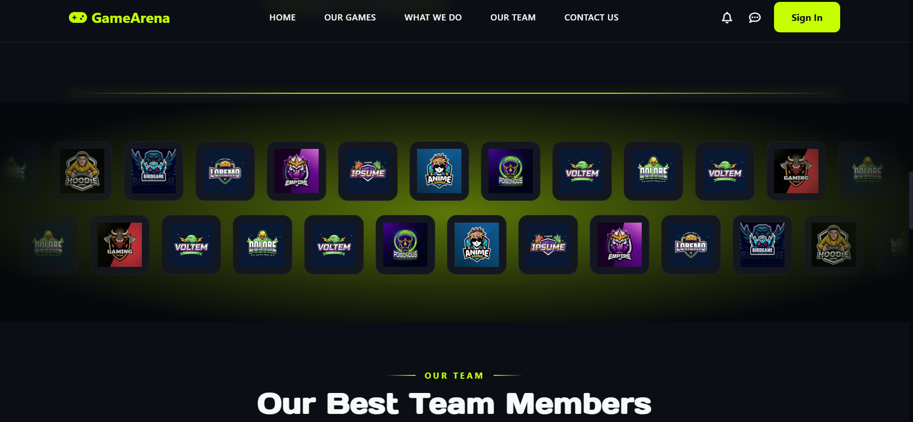
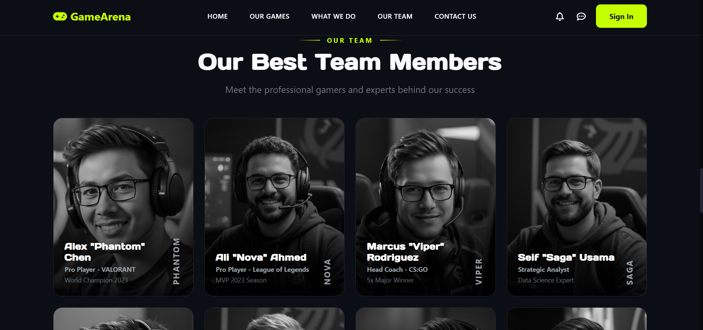
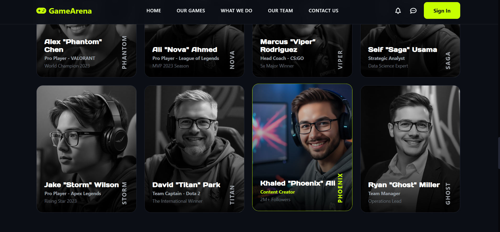
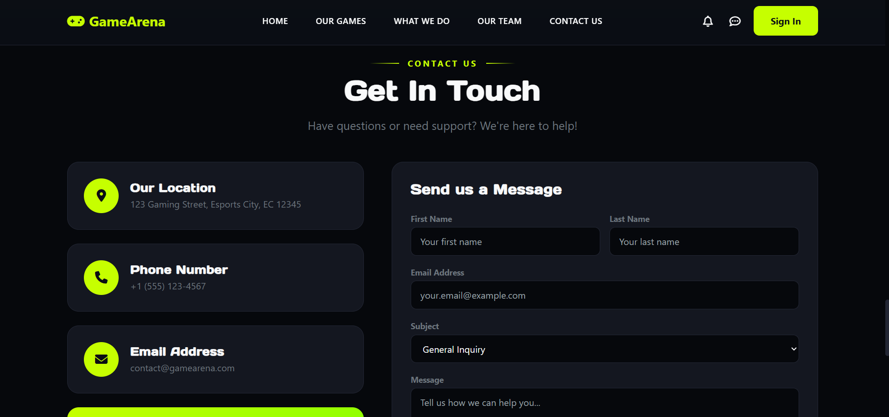
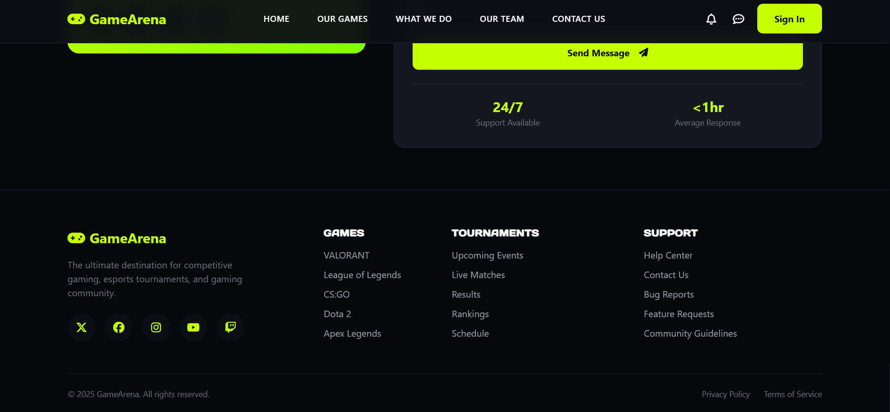
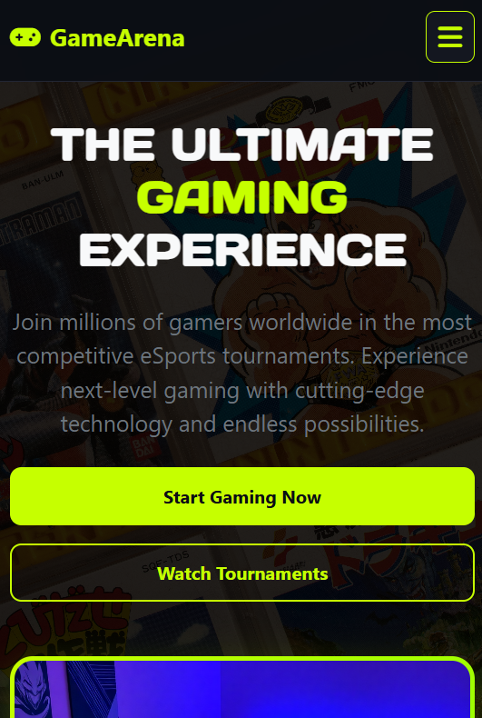

# 🎮 GameArena — Ultimate Gaming & eSports Landing Page

<div align="center">

  
  
  
  
  
  

  <p align="center">
    A high-performance, dark-themed, ultra-modern eSports and gaming landing page built with semantic HTML5, modern CSS3 animations, Bootstrap 5 grid layout, and advanced pure CSS interactivity.
  </p>

  <p align="center">
    🚀 <b>Live Demo:</b> <a href="https://games-arena-landing-page.vercel.app/" target="_blank">https://games-arena-landing-page.vercel.app/</a>
  </p>

  <p align="center">
    <a href="#live-demo">Live Demo</a> •
    <a href="#key-features">Key Features</a> •
    <a href="#screenshots">Screenshots</a> •
    <a href="#tech-stack">Tech Stack</a> •
    <a href="#project-structure">Project Structure</a> •
    <a href="#pure-css-innovations">CSS Innovations</a> •
    <a href="#getting-started">Getting Started</a> •
    <a href="#customization">Customization</a>
  </p>

</div>

---

## 📌 Overview

**GameArena** is a premium landing page designed for eSports platforms, gaming studios, tournament hosts, and interactive entertainment brands. Built with a sleek dark aesthetic (`#0b0e14`), vibrant neon lime accents (`#c6ff00`), custom glassmorphic badges, dynamic keyframe marquees, and zero JavaScript dependencies for interactive UI elements like multi-page sliders and mobile navigation.

---

## 🌐 Live Demo

Check out the live deployed site here:  
👉 **[https://games-arena-landing-page.vercel.app/](https://games-arena-landing-page.vercel.app/)**

---

## ✨ Key Features

- 🎯 **Esports & Cyberpunk Aesthetics**: Custom dark mode architecture with neon lime primary highlights, glowing backdrops, section badge dividers, and typography tailored for gaming (`Days One` & `Chakra Petch`).
- 🎠 **Pure CSS Multi-Page Slider**: Innovative 3-page slider displaying 9 games (3 per page) using zero JS. Driven entirely by pure CSS radio buttons and CSS grid transforms with zero layout jump.
- 📱 **Pure CSS Mobile Drawer**: Fully functional responsive navigation menu powered by CSS sibling selectors and checkbox state triggers (`#nav-toggle`).
- ♾️ **Dual-Direction Continuous Marquee**: Infinite-looping sponsor ticker showcasing 12+ brand logos scrolling simultaneously in opposing left and right directions.
- 👥 **Monochrome to Neon Team Showcase**: Team member roster cards featuring monochrome (grayscale) images by default that smoothly expand and transition to vibrant neon color states on hover.
- 🎮 **Interactive "What We Do" Grid**: 8-tile feature grid showcasing PC, Mobile, AR/VR, PS4, and 3D modeling game development services alongside custom graphics.
- 📩 **Complete Contact & SLA Section**: Responsive contact form with fixed-size non-resizable message box, direct inquiry channels, live community links, and quick 24/7 SLA counters.
- 📱 **Fully Mobile Responsive**: Pixel-perfect layout adapted for mobile, tablet, laptop, and ultra-wide desktop viewports using Bootstrap 5 flex grid and media queries.

---

## 🖼️ Screenshots

<div align="center">

### 🌟 Full Landing Page Preview


### 🎯 Hero & Header Navigation


### 🎠 Our Latest Games (Pure CSS Slider)


### 🎮 What We Do (Services Grid)


### ♾️ Sponsors & Partners (Dual Infinite Marquee)


### 👥 Team Members Roster


### ✨ Team Member Hover Effect (Monochrome to Neon)


### 📩 Contact Us Section


### 🔻 Footer Section


### 📱 Mobile Responsive View & Drawer Menu


</div>

---

## 🛠️ Tech Stack & Dependencies

| Technology / Library | Purpose | Source / Version |
| :--- | :--- | :--- |
| **HTML5** | Semantic structure & document outline | Native Standard |
| **CSS3** | Custom variables, keyframes, transitions & layout | Native Standard |
| **Bootstrap 5** | Responsive grid system, breakpoints & utilities | v5.3.3 CDN |
| **Font Awesome 6** | Modern UI & gaming vector icons | v6.5.1 Free CDN |
| **Google Fonts** | Custom typography (`Days One`, `Chakra Petch`, `Inter`) | Google Fonts API |

---

## 📁 Project Structure

```ascii
Task 06-games-arena-landing-page/
├── css/
│   └── style.css            # Core stylesheet (variables, keyframes, pure CSS slider & drawer)
├── images/                  # High-resolution gaming assets, logos, avatars, and UI graphics
│   ├── avatar-1.png .. 8.png
│   ├── favicon.png
│   ├── hero-img.png
│   ├── hero-bg.jpg
│   ├── latest-games-1.png .. 9.png
│   ├── logo-1.jpg .. 12.jpg
│   └── what-we-do-1.png & 2.png
├── screenshots/             # Landing page preview screenshots
│   ├── 00-full-size-screenshot.png
│   ├── 01-hero-section.png
│   ├── 02-latest-games-section.png
│   ├── 03-what-we-do-section.png
│   ├── 04-sponsors-marquee.png
│   ├── 05-team-members-section.png
│   ├── 06-team-card-hover-effect.png
│   ├── 07-contact-us-section.png
│   ├── 08-footer-section.png
│   └── 09-mobile-responsive-view.png
├── index.html               # Main HTML5 landing page document
└── README.md                # Project documentation
```

---

## ⚡ Pure CSS Technical Innovations

### 1. Zero-JS Multi-Page Games Slider
The 9-game showcase slider utilizes CSS radio button inputs coupled with CSS sibling combinations (`:checked ~ .games-slider-wrapper .games-slider-track`):
- Page 1 (`#games-page-1:checked`): `transform: translateX(0%)`
- Page 2 (`#games-page-2:checked`): `transform: translateX(-100%)`
- Page 3 (`#games-page-3:checked`): `transform: translateX(-200%)`

### 2. Zero-JS Mobile Navigation Drawer
The header mobile drawer relies on a hidden checkbox input sibling state:
```html
<input type="checkbox" id="nav-toggle" class="nav-toggle-input">
```
Clicking the `<label for="nav-toggle">` toggles menu visibility smoothly via CSS max-height / opacity transitions.

### 3. Dual Infinite Marquee Animation
Sponsor logo streams run on CSS `@keyframes marqueeLeft` and `@keyframes marqueeRight` with hardware-accelerated `translate3d` transforms for 60fps performance across desktop and mobile.

---

## 🚀 Getting Started

### Prerequisites
No node packages or build tools are required! All dependencies are loaded via fast CDNs.

### Quick Start
1. **Clone or Download** the repository:
   ```bash
   git clone https://github.com/mariammgamall/route-frontendc49-tasks.git
   ```
2. **Navigate** into the project directory:
   ```bash
   cd route-frontendc49-tasks/"Task 06-games-arena-landing-page"
   ```
3. **Open `index.html`** directly in any web browser, or launch using VS Code **Live Server**.

---

## 🎨 Color Palette & CSS Variables

The design system is managed via CSS root variables in `css/style.css`:

```css
:root {
  --primary: #c6ff00;          /* Neon Lime Accent */
  --primary-dark: #b0e600;     /* Darker Lime Hover */
  --primary-glow: rgba(198, 255, 0, 0.4);
  --bg-dark: #0b0e14;         /* Main Dark Background */
  --bg-darker: #06080c;       /* Secondary Section Background */
  --bg-card: #141720;         /* Card Surfaces */
  --bg-card-alt: #1a1e2a;     /* Secondary Card State */
  --border-color: #222634;    /* Subtle Card Borders */
  --text-light: #f8f9fa;      /* Heading & Primary Text */
  --text-muted: #9aa0a6;      /* Subtitle & Secondary Text */
}
```

---

