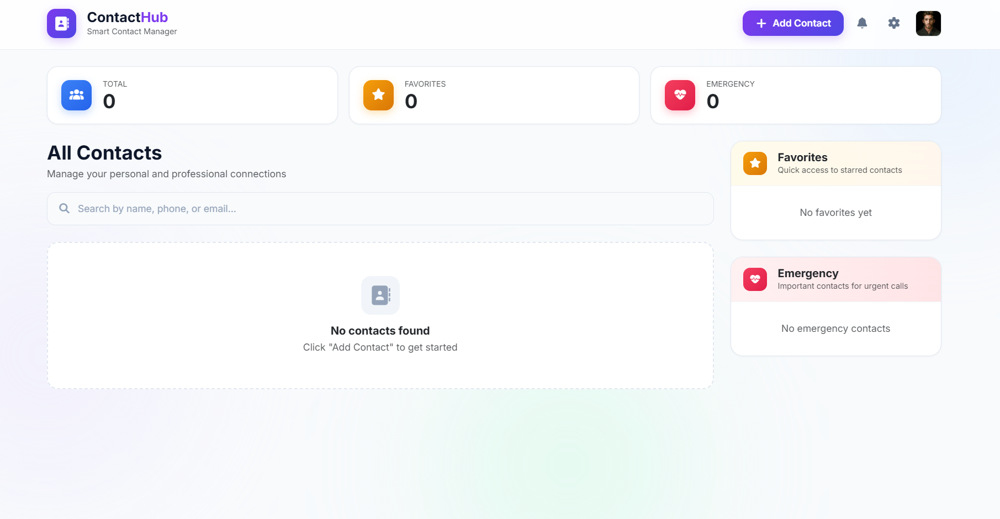
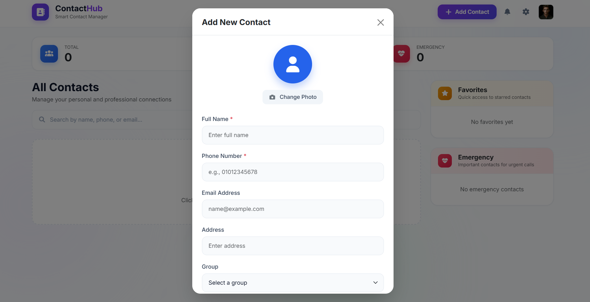
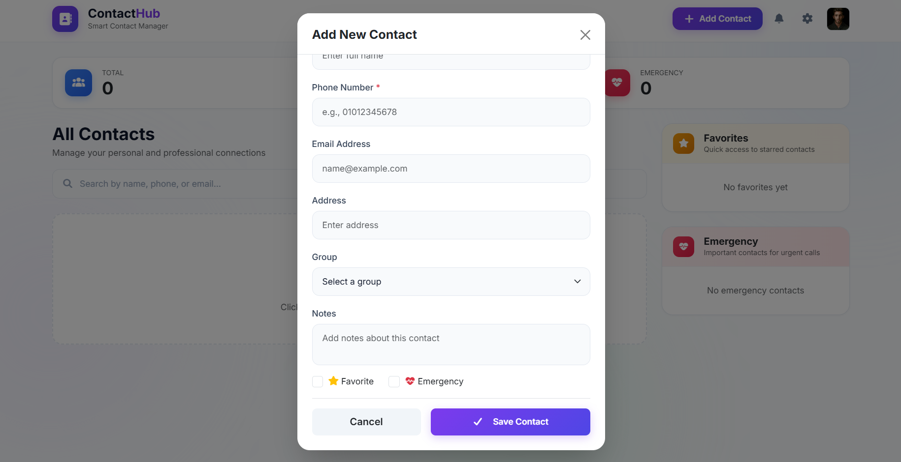
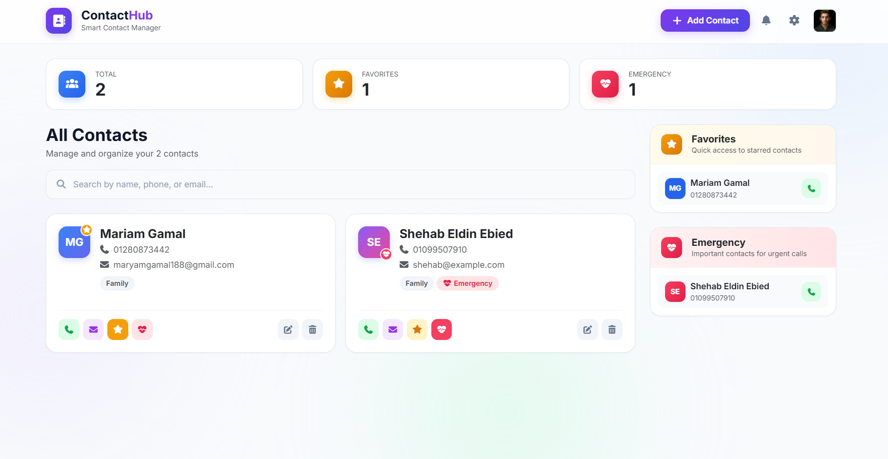
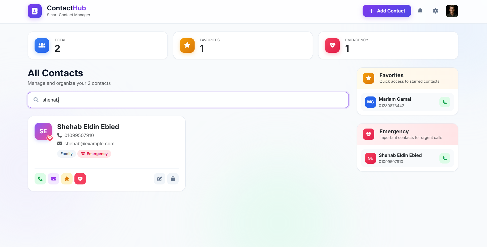
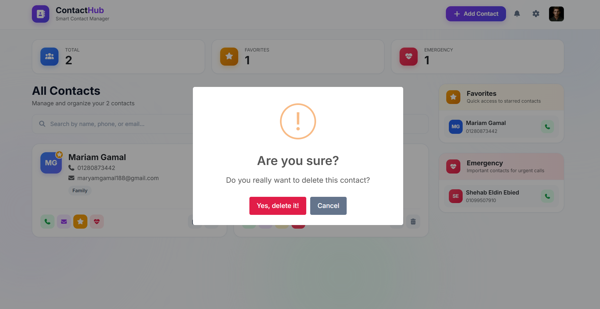
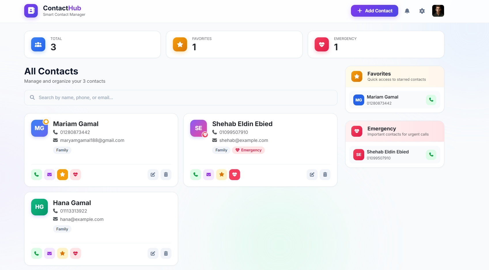
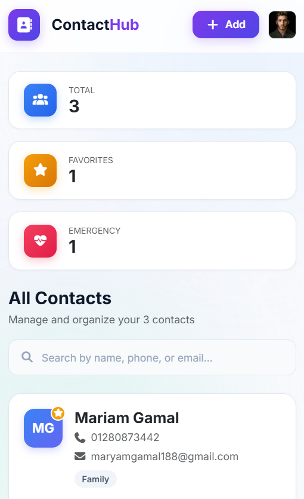

# 📇 ContactHub — Smart Contact Manager

[](https://smart-contact-managerr.vercel.app/)

🔗 **Live Demo**: [https://smart-contact-managerr.vercel.app/](https://smart-contact-managerr.vercel.app/)

**ContactHub** is a modern, responsive, and beginner-friendly Contact Management Web Application designed to manage personal and professional connections effortlessly. Built with HTML5, CSS3, Bootstrap 5, SweetAlert2, and standard Vanilla JavaScript, it offers full CRUD functionality, real-time search, favorite & emergency contact management, strict form validation, and LocalStorage data persistence.

---

## 🌟 Key Features

- **⚡ Full CRUD Operations**:
  - **Add Contact**: Modal form with photo upload / automatic initials preview.
  - **Display Contacts**: Grid layout with initial avatar circles, group tags, and emergency badges.
  - **Edit Contact**: Pre-populates contact details in the modal for easy updates.
  - **Delete Contact**: Confirmation modal before removal with SweetAlert2.

- **🔍 Real-Time Search**:
  - Instant live search by **Full Name**, **Phone Number**, or **Email Address**.

- **⭐ Favorites & Emergency Contacts**:
  - Mark contacts as **Favorites** or **Emergency** connections.
  - Quick-access sidebar widgets with direct call buttons and live counter stats.

- **📞 Action Links**:
  - Direct call link: `<a href="tel:PHONE">`
  - Direct email link: `<a href="mailto:EMAIL">`

- **🧪 Form Validation**:
  - Real-time input error highlights.
  - Full Name validation (letters & spaces, 2-50 characters).
  - Egyptian Phone Number validation (11 digits starting with `010`, `011`, `012`, or `015`).
  - Email Address validation (`name@domain.com`).

- **💾 LocalStorage Persistence**:
  - Automatically saves all contacts, favorites, and emergency states.
  - Retains data seamlessly across page reloads and browser sessions.

- **🎨 Modern UI & Responsive Design**:
  - Glassmorphism top navigation bar, ambient background glow, clean stat cards, non-resizable textarea, and fixed-scrollable modal dialog.

---

## 🖼️ Application Screenshots

### 1. Empty State (0 Contacts)
*Initial view displaying 0 stats, empty state dashed box, and sidebar widgets.*


---

### 2. Form Validation & Error Messages
*Real-time validation for Full Name, Egyptian Phone Number, and Email Address.*



---

### 3. All Contacts Grid
*Contact cards displaying custom avatars/initials, group tags, emergency badges, and action buttons.*


---

### 4. Real-Time Search Filtering
*Filtering contact cards instantly as the user types.*


---

### 5. SweetAlert2 Delete Confirmation
*Confirmation alert prompt before deleting a contact.*


---

### 6. LocalStorage Data Persistence
*Data remains intact across page reloads and browser restarts.*


---

### 7. Responsive Mobile Layout
*Optimized view for mobile devices and tablets.*


---

## 🛠️ Built With

- **HTML5**: Semantic web structure.
- **CSS3**: Custom modern styling, glassmorphism, background ambient glow.
- **Bootstrap 5**: Grid layout, buttons, stat cards, and modal components.
- **FontAwesome 6**: Modern UI icons.
- **SweetAlert2**: Interactive success popups and delete confirmation alerts.
- **Vanilla JavaScript**: Standard beginner-friendly DOM manipulation, event listeners, loops, and `localStorage`.

---

## 📁 Project Structure

```text
Task 09-smart-contact-manager/
│
├── CSS/
│   ├── all.min.css            # FontAwesome CSS
│   ├── bootstrap.min.css      # Bootstrap 5 CSS
│   └── main.css               # Custom styles & themes
│
├── JS/
│   ├── bootstrap.bundle.min.js # Bootstrap 5 JS Bundle
│   └── script.js              # Application logic & CRUD operations
│
├── images/
│   ├── avatar-4.jpg           # Header profile photo
│   └── favicon.png            # App logo & favicon
│
├── screenshots/               # Project demonstration screenshots
│   ├── 01-empty-state.png
│   ├── 02a-form-validation.png
│   ├── 02b-form-validation.png
│   ├── 03-contacts-grid.png
│   ├── 04-search-filter.png
│   ├── 05-delete-confirmation.png
│   ├── 06-localstorage-persistence.png
│   └── 07-mobile-screen.png
│
├── index.html                 # Main HTML document
└── README.md                  # Documentation
```

---

## 🚀 How to Run

1. Clone or download the repository to your local machine.
2. Open `index.html` directly in any web browser (Google Chrome, Microsoft Edge, Mozilla Firefox, etc.).
3. Enjoy managing your contacts!
