# 🌟 Mariam Gamal — Personal Portfolio Website

[](https://developer.mozilla.org/en-US/docs/Web/HTML)
[](https://developer.mozilla.org/en-US/docs/Web/CSS)
[](https://getbootstrap.com/)
[](https://developer.mozilla.org/en-US/docs/Web/JavaScript)
[](https://personall-portfoliio-websiite.vercel.app/)

> A modern, responsive, and feature-rich personal portfolio web application built for **Mariam Gamal** — *Computer Engineer & AI Developer*.
>
> 🌐 **Live Website**: [https://personall-portfoliio-websiite.vercel.app/](https://personall-portfoliio-websiite.vercel.app/)

---

## 🌐 Live Demo

Explore the live application online:  
👉 **[https://personall-portfoliio-websiite.vercel.app/](https://personall-portfoliio-websiite.vercel.app/)**

---

## 🎓 Academic Submission Context

> **Course**: Frontend Diploma (C49)  
> **Assignment**: Task 10 — Personal Portfolio Website  
> **Institution**: Route Academy — IT Training Center  
> **Student / Developer**: Mariam Gamal  

---

## 📌 Table of Contents

- [🌐 Live Demo](#-live-demo)
- [🎓 Academic Submission Context](#-academic-submission-context)
- [✨ Features](#-features)
- [📸 Application Screenshots](#-application-screenshots)
- [🛠️ Tech Stack & Architecture](#️-tech-stack--architecture)
- [📁 Project Structure](#-project-structure)
- [🚀 Quick Start & Installation](#-quick-start--installation)
- [🎨 Key Sections Overview](#-key-sections-overview)
- [📱 Responsive Design](#-responsive-design)

---

## ✨ Features

- **🌙 Dark / Light Mode Switcher**: Seamless theme switcher with persistent user preference saved via `localStorage`.
- **💻 Interactive Code Terminal (`mariam.js`)**: Real-time code terminal window with vibrant, scoped syntax highlighting (`.keyword`, `.variable`, `.string`, `.number`, `.boolean`, `.comment`) visible in both light and dark themes.
- **🎯 Category-Based Project Filtering**: Interactive portfolio tab system (`الكل`, `تطبيقات ويب`, `تطبيقات الموبايل`, `تصميم UI/UX`, `الذكاء الاصطناعي`) allowing instant project filtering without page reloads.
- **💬 Testimonials Carousel**: Dynamic testimonial slider with smooth controls and indicator navigation.
- **⚙️ Live Customization Sidebar**: Floating theme customizer drawer allowing real-time switching of accent color palettes and Google Typography (`Alexandria`, `Cairo`, `Tajawal`, `Outfit`, `Inter`).
- **📱 Fully Responsive RTL Layout**: Tailored for Right-To-Left (RTL) Arabic text flow across Desktop, Tablet, and Mobile screens with zero horizontal overflow.
- **✉️ Fixed Non-Resizable Contact Form**: Contact form with strict non-resizable textarea boundaries and direct action buttons (`mailto:` & `tel:`).
- **⚓ Smooth Navigation & Active ScrollSpy**: Active link indicator on header navbar that highlights current section dynamically during scrolling.

---

## 📸 Application Screenshots

### 1. 🌅 Hero Section (Light Mode)
*Hero section in Light Mode showing the navbar, title, role capsule, action buttons, and profile frame.*
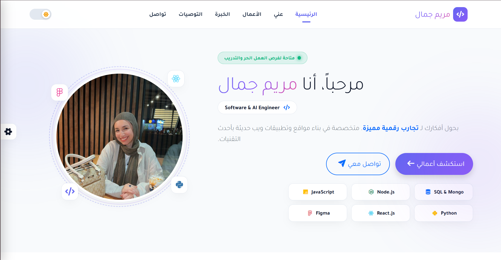

---

### 2. 🌙 Hero Section (Dark Mode)
*Hero section in Dark Mode featuring dark theme tokens and contrast highlights.*
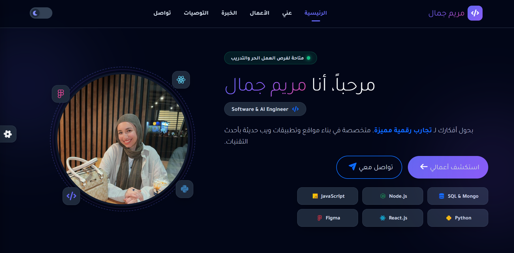

---

### 3. 👤 About Section ("عني")
*About section showcasing the personal bio, decorative underline, and key metrics.*
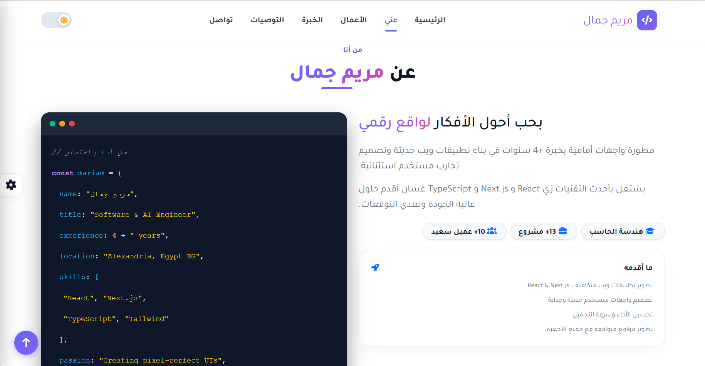

---

### 4. ⚡ Technical Skills Section
*Technical skills section showcasing core competencies, proficiency progress bars, and domain expertise.*
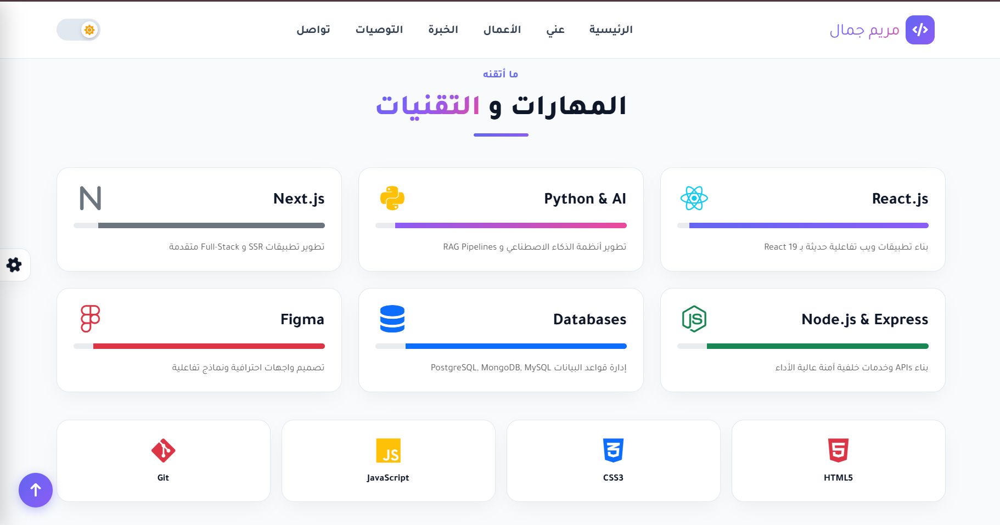

---

### 5. 🚀 Projects Section ("الأعمال")
*Showcase of production portfolio projects with dynamic category filter tabs.*
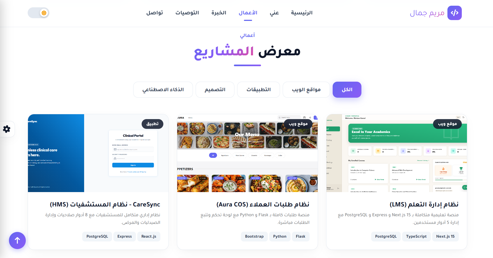

---

### 6. 💼 Experience Section ("الخبرة")
*Structured career and education timeline with 3 equal-dimension feature cards.*
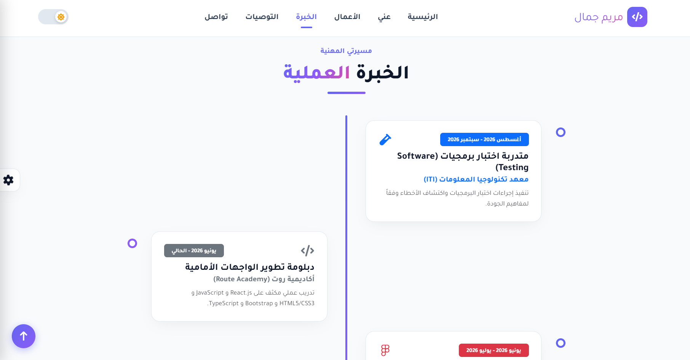

---

### 7. 💬 Testimonials Section ("التوصيات")
*Testimonial carousel card with navigation controls.*
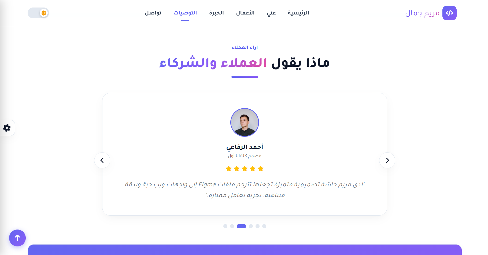

---

### 8. 📊 Statistics Part
*Counter statistics section highlighting key metrics.*
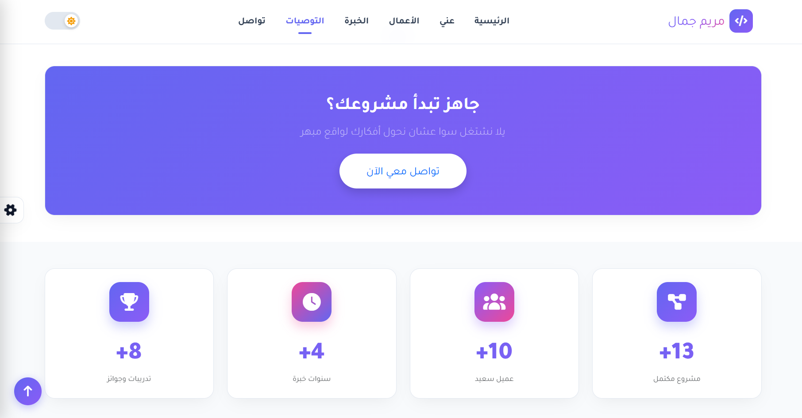

---

### 9. ✉️ Contact Me Section ("تواصل معي")
*Contact form with fixed non-resizable textarea and direct contact cards.*
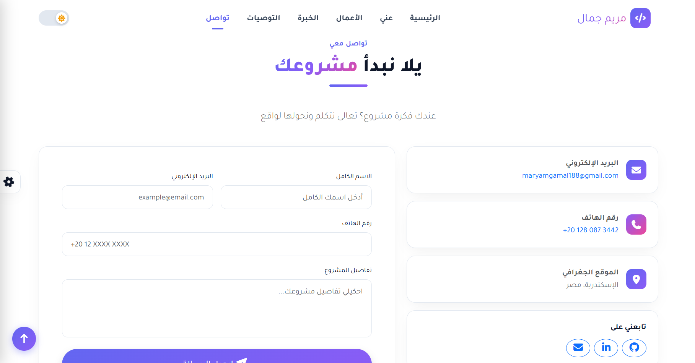

---

### 10. ⚓ Footer Section
*Centered 4-column footer layout with quick links, services, contact info, and copyright.*
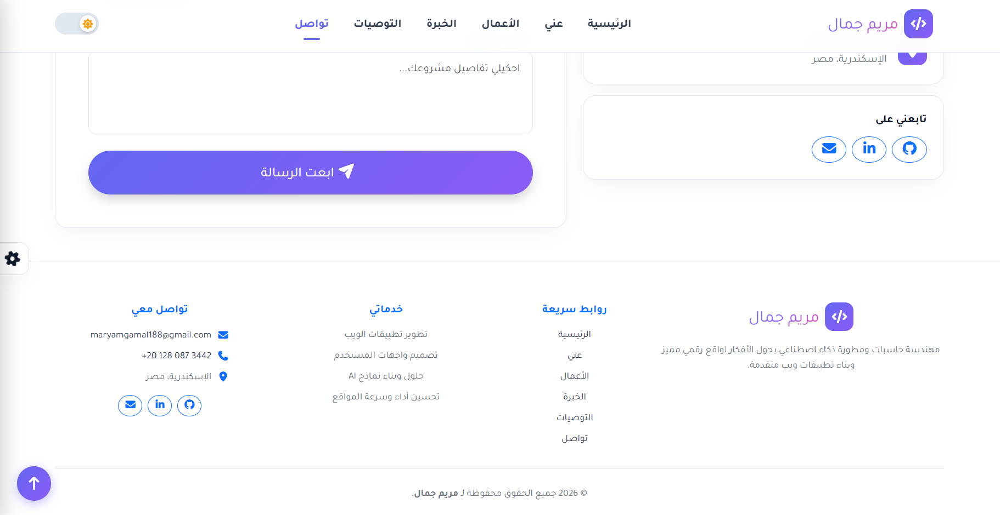

---

### 11. ⚙️ Settings Sidebar Customizer
*Theme customizer drawer open showing color palette picker and Google Fonts selector.*
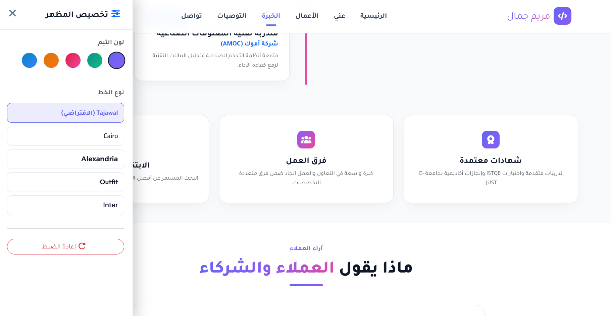

---

### 12. 📱 Hero Mobile Screen View
*Mobile viewport layout with action buttons aligned side-by-side on a single line.*
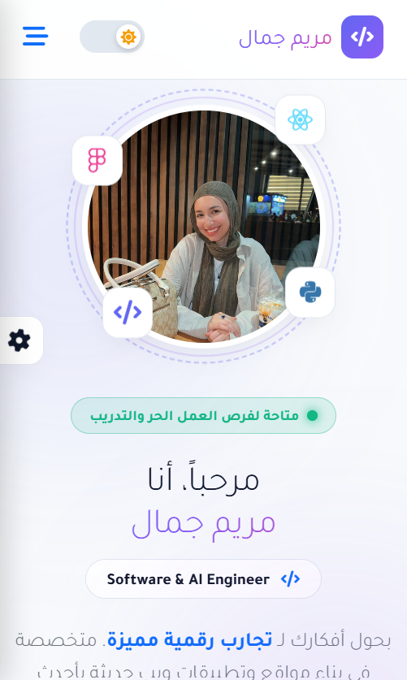

---

### 13. 🌐 Full Size Screenshot (Light Mode)
*Complete single-page application overview in Light Mode.*


---

### 14. 🌃 Full Size Screenshot (Dark Mode)
*Complete single-page application overview in Dark Mode.*


---

## 🛠️ Tech Stack & Architecture

- **Structure**: HTML5 (Semantic elements, ARIA accessibility attributes, RTL `dir="rtl"` flow).
- **Styling**: Vanilla CSS3 + Bootstrap 5.3 (RTL System, CSS Variables, Flexbox, CSS Grid).
- **Logic**: Pure Vanilla JavaScript (ES6 Modules, DOM Events, LocalStorage Management).
- **Typography**: Google Fonts (`Alexandria`, `Cairo`, `Tajawal`, `Outfit`, `Inter`).
- **Icons**: FontAwesome 6.4 Free Solid & Brands icons.

---

## 📁 Project Structure

```text
Task 10-personal-portfolio-website/
├── CSS/
│   ├── all.min.css          # FontAwesome 6 Icons stylesheet
│   ├── bootstrap.min.css    # Bootstrap 5 RTL layout framework
│   └── style.css            # Custom CSS Design System & Theme Tokens
├── JS/
│   ├── bootstrap.bundle.min.js # Bootstrap 5 JS Bundle
│   └── index.js             # Core Vanilla JS Application Logic
├── images/
│   ├── favicon.png          # Website Favicon
│   ├── hero-section.jpeg    # Profile Image
│   └── projects/            # Portfolio Project Showcase Media
├── screenshots/             # 14 Application Screenshots for Route Assignment
│   ├── 01-hero-light.png
│   ├── 02-hero-dark.png
│   ├── 03-about-section.png
│   ├── 04-skills-in-about-section.png
│   ├── 05-projects-section.png
│   ├── 06-experience-section.png
│   ├── 07-testimonials-section.png
│   ├── 08-statistics-part.png
│   ├── 09-contactme-section.png
│   ├── 10-footer-section.png
│   ├── 11-settings-sidebar.png
│   ├── 12-hero-mobile-screen.png
│   ├── 13-full-size-screenshot-light-mode.png
│   └── 14-full-size-screenshot-dark-mode.png
├── index.html               # Main Single-Page HTML Document
└── README.md                # Project Documentation
```

---

## 🚀 Quick Start & Installation

### Prerequisites
- Any modern web browser (Google Chrome, Mozilla Firefox, Microsoft Edge, Safari).
- Python 3.x (optional for running a local server).

### Running Locally

1. **Clone or Download the Repository**:
   ```bash
   git clone https://github.com/mariammgamall/route-frontendc49-tasks.git
   cd route-frontendc49-tasks/'Task 10-personal-portfolio-website'
   ```

2. **Launch with Python HTTP Server**:
   ```bash
   python -m http.server 8000
   ```

3. **Open in Browser**:
   Navigate to `http://localhost:8000/` in your browser.

---

## 🎨 Key Sections Overview

1. **Header Navigation**: Fixed glassmorphic navbar with active scroll indicators, smooth anchor links, and dark/light capsule switcher.
2. **Hero Section**: Personal introduction, status badge (`متاحة لفرص العمل الحر والتدريب`), role capsule (`Software & AI Engineer`), side-by-side action buttons, 3x2 tech grid, and animated profile ring.
3. **About Section ("عني")**: Personal biography, 3 key metrics (`هندسة الحاسب`, `13+ مشروع`, `10+ عميل سعيد`), "ما أقدمه" card, and the interactive `mariam.js` code window displaying location `Alexandria, Egypt EG`.
4. **Portfolio Section ("الأعمال")**: Showcase of 13 production projects with dynamic filter tabs.
5. **Experience Section ("الخبرة")**: Structured career and education timeline with 3 equal-dimension feature cards (`شهادات معتمدة`, `فرق العمل`, `الابتكار والحلول`).
6. **Statistics Section**: High-impact counters highlighting completed projects, happy clients, years of experience, and awards.
7. **Contact Section ("تواصل معي")**: Direct communication form with non-resizable textarea and direct mail/phone cards.
8. **Footer Section**: Centered 4-column footer layout with quick links, service lists, contact info, and copyright notice.

---

## 📱 Responsive Design

The website is fully optimized and tested across multiple device viewports:
- **Desktop (1400px+)**: Multi-column grid layout with spacious padding.
- **Laptop / Tablet (768px - 1199px)**: Adaptive side-by-side grid flex and optimized font sizing.
- **Mobile (320px - 767px)**: Touch-friendly navigation drawer, side-by-side hero buttons (`flex-nowrap`), and full-width touch targets.
