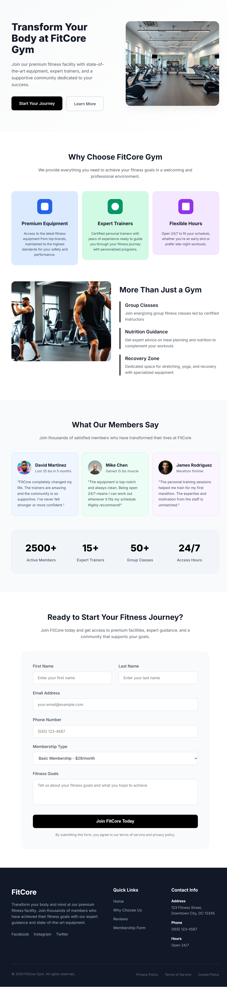
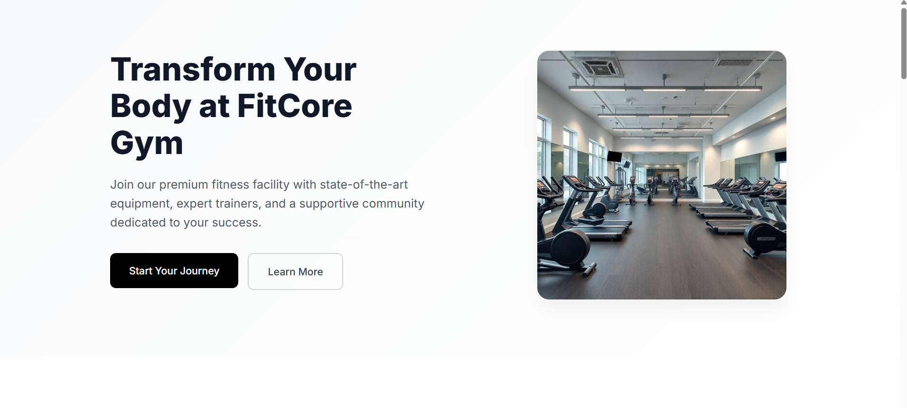
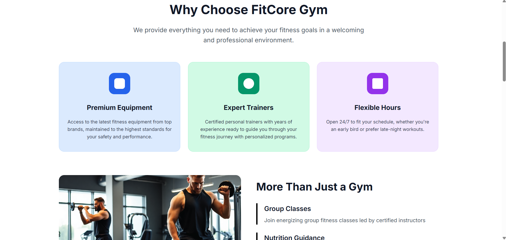
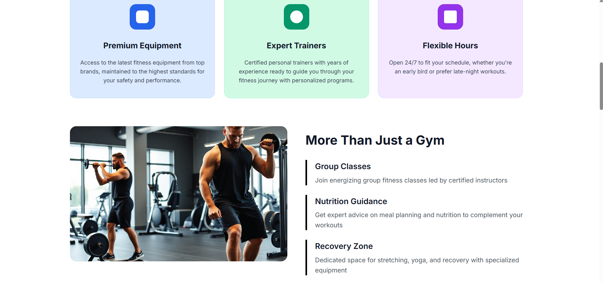
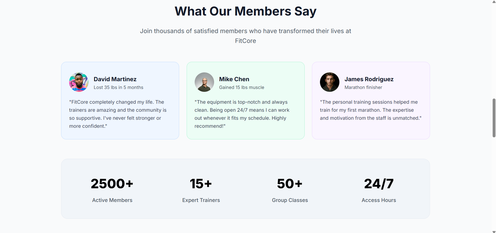
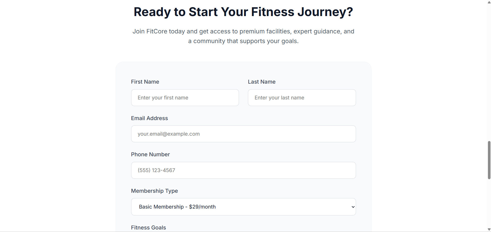
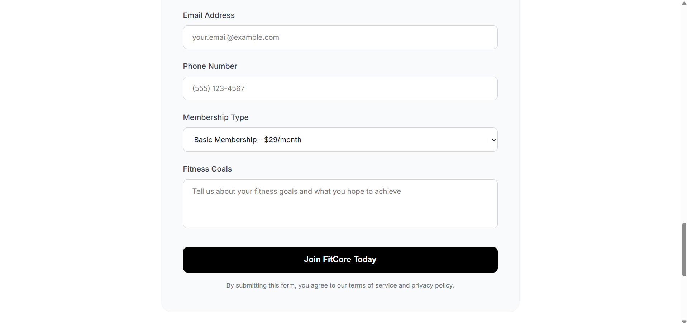
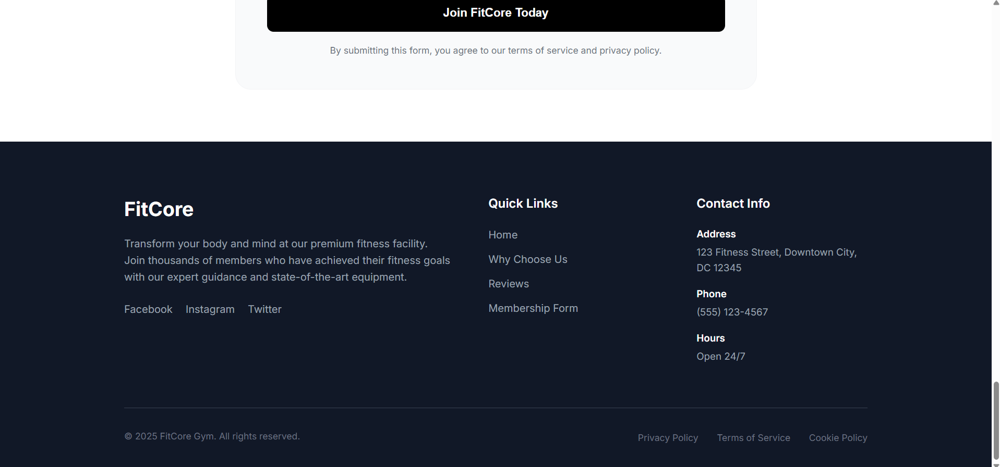

# 🏋️ FitCore Gym - Landing Page


A modern, responsive, and visually appealing landing page for **FitCore Gym**, designed to showcase fitness facilities, expert trainers, member reviews, membership options, and contact details.

🔗 **Live Demo:** [https://fitcore-gym-landing-page.vercel.app/](https://fitcore-gym-landing-page.vercel.app/)

---

## 📌 Features

- 🎯 **Hero Section:** Catchy headline, call-to-action buttons, and high-quality gym imagery.
- 💡 **Why Choose Us:** Highlighted feature cards (Premium Equipment, Expert Trainers, Flexible Hours) + deep-dive overview.
- 💬 **Testimonials & Stats:** Real member reviews with custom avatars and key achievement statistics (2,500+ Members, 15+ Trainers, 24/7 Access).
- 📝 **Membership Form:** Clean, user-friendly sign-up form with input fields for personal info and fitness goals.
- 📱 **Responsive Design:** Optimized layout for seamless viewing on Mobile, Tablet, and Desktop screens.
- 🎨 **Modern Aesthetics:** Tailored color palette, sleek cards, hover animations, and clean typography powered by Google Fonts (`Inter`).

---

## 📸 Screenshots & Preview

<details open>
<summary><b>🖼️ Full Page Overview</b></summary>


</details>

<details>
<summary><b>1️⃣ Hero Section</b></summary>


</details>

<details>
<summary><b>2️⃣ Why Choose Us Section</b></summary>


</details>

<details>
<summary><b>3️⃣ Features & Services Section</b></summary>


</details>

<details>
<summary><b>4️⃣ Testimonials & Member Stats</b></summary>


</details>

<details>
<summary><b>5️⃣ Membership Sign-Up Form</b></summary>



</details>

<details>
<summary><b>6️⃣ Footer & Quick Links</b></summary>


</details>

---

## 🛠️ Tech Stack

- **HTML5:** Semantic structural markup.
- **CSS3:** Custom layouts using CSS Flexbox, Grid, and traditional Float techniques with smooth transitions.
- **Google Fonts:** `Inter` font family for clean UI typography.

---

## 📂 Project Structure

```text
fitcore-gym-landing-page/
│
├── css/
│   └── style.css            # Main CSS stylesheet
├── images/                  # Website images & avatars
│   ├── avatar-1.jpg
│   ├── avatar-2.jpg
│   ├── avatar-3.jpg
│   ├── favicon.png
│   ├── hero-section-img.png
│   └── why-choose-us.png
├── screenshots/             # Section screenshots for documentation
│   ├── 01-hero-section.png
│   ├── 02-why-choose-us.png
│   ├── 03-services.png
│   ├── 04-testimonials.png
│   ├── 05a-join-us.png
│   ├── 05b-join-us.png
│   ├── 06-footer.png
│   └── 07-full-page-screenshot.png
├── index.html               # Main HTML webpage
└── README.md                # Project documentation
```

---

## 🚀 How to Run Locally

1. **Clone the repository:**
   ```bash
   git clone https://github.com/mariammgamall/route-frontendc49-tasks.git
   ```
2. **Navigate to the project directory:**
   ```bash
   cd route-frontendc49-tasks/"Task 2-fitcore-gym-landing-page"
   ```
3. **Open in browser:**
   Double-click `index.html` or use **Live Server** extension in VS Code.

---

## 👩‍💻 Author

Developed by **Mariam Gamal** as part of Route IT Training Center Frontend Diploma (C49).
