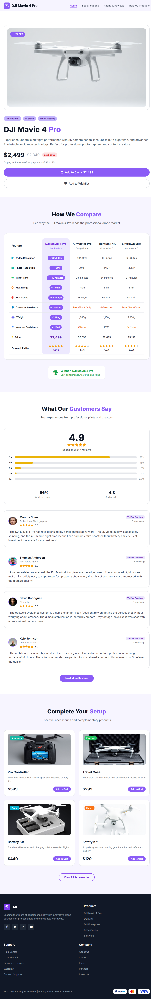
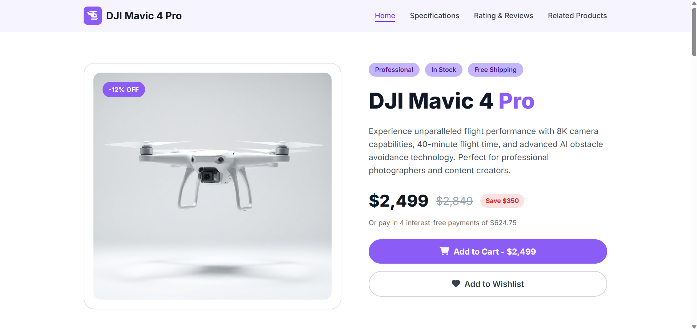
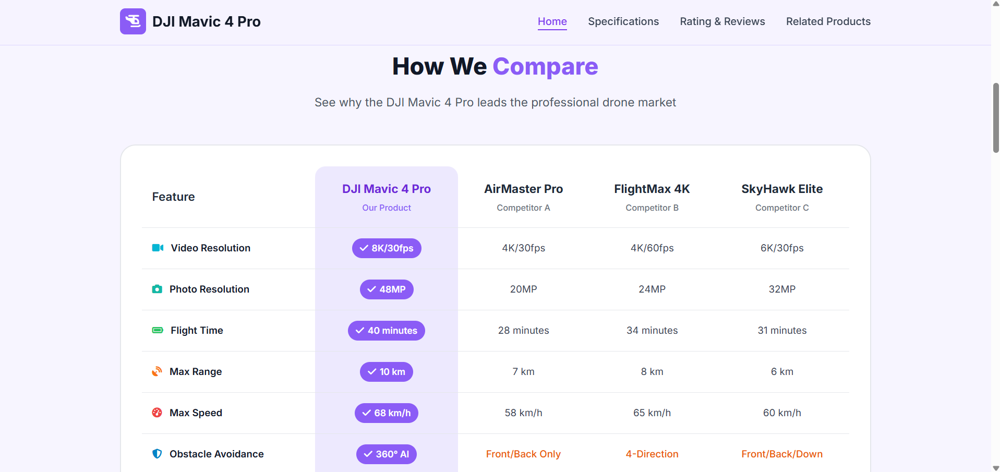
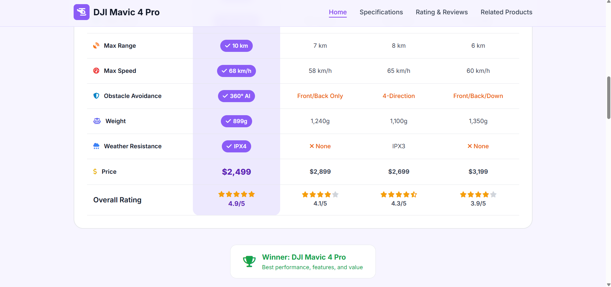
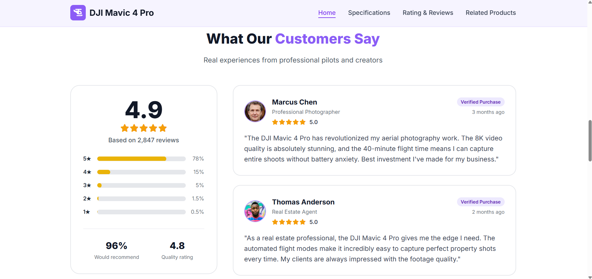
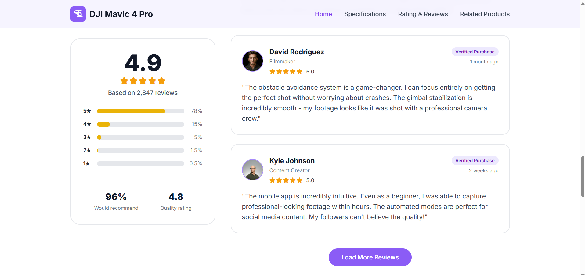
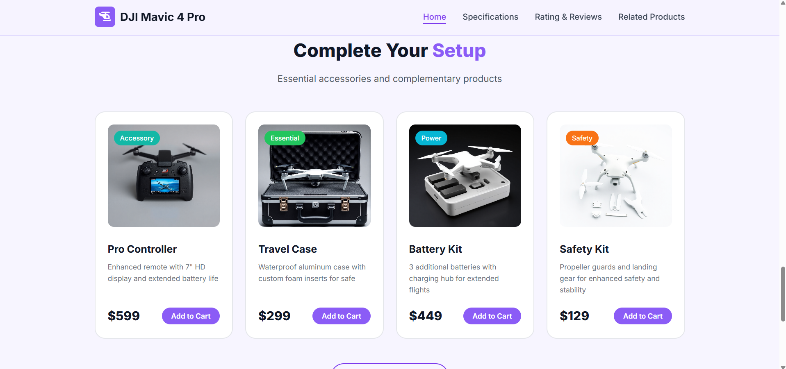
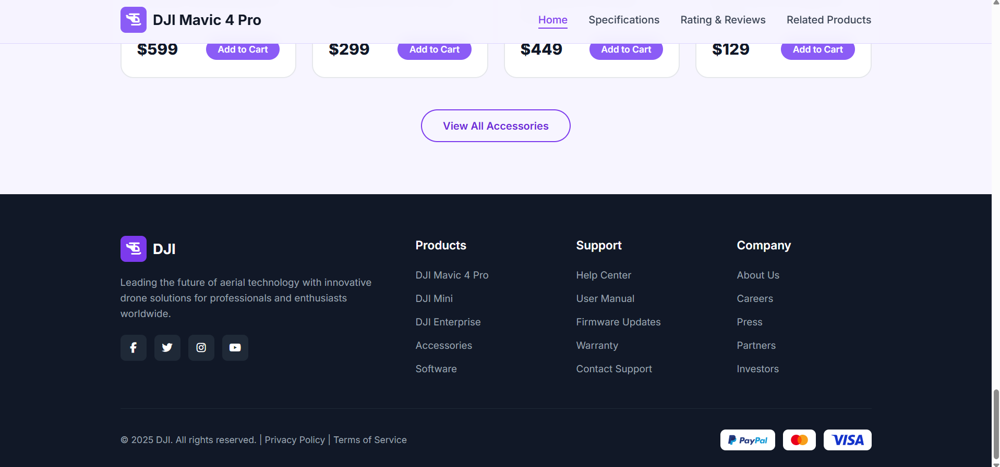

# 🛸 DJI Mavic 4 Pro - Drone Product Landing Page


A modern, responsive, and high-converting product landing page designed for the **DJI Mavic 4 Pro** drone. Built with pure HTML5 & CSS3, featuring a dark sleek theme, interactive comparison matrix, rating breakdowns, related accessory cards, and payment options.

🔗 **GitHub Repository:** [https://github.com/mariammgamall/route-frontendc49-tasks](https://github.com/mariammgamall/route-frontendc49-tasks)  
🚀 **Live Demo:** [https://mariam-drone-product-landing-page.vercel.app/](https://mariam-drone-product-landing-page.vercel.app/)

---

## 📌 Features

- 🎯 **Hero Showcase:** Catchy discount badge (-12% OFF), instant price highlights, tag badges, and quick CTA buttons (*Add to Cart* & *Wishlist*).
- 📊 **Interactive Comparison Matrix:** Side-by-side technical specs table comparing the **DJI Mavic 4 Pro** against top market competitors (*AirMaster Pro*, *FlightMax 4K*, *SkyHawk Elite*).
- ⭐ **Ratings & Review Breakdown:** Visual rating bars (4.9/5 stars), recommendation percentage stats, and real customer review cards with verified buyer tags.
- 🛒 **Related Products & Accessories:** Interactive product cards showing pricing, ratings, and purchase actions for propellers, batteries, and carrying cases.
- 💳 **Footer & Payment Methods:** Quick navigation links, email newsletter subscription, and accepted payment badge icons (*Visa*, *Mastercard*, *PayPal*).
- 📱 **Fully Responsive:** Seamless layout adjustments for desktop, tablet, and mobile views.
- 🎨 **Modern Aesthetics:** Vibrant teal/cyan glow accents, glassmorphic cards, custom typography powered by Google Fonts (`Inter`), and smooth hover transitions.

---

## 📸 Screenshots & Visual Preview

<details open>
<summary><b>🖼️ 00. Full Page Preview</b></summary>

<br>


</details>

<details>
<summary><b>1️⃣ Hero Section</b></summary>

<br>


</details>

<details>
<summary><b>2️⃣ Specifications & Comparison Table</b></summary>

<br>



</details>

<details>
<summary><b>3️⃣ Customer Reviews & Rating Breakdown</b></summary>

<br>



</details>

<details>
<summary><b>4️⃣ Related Products & Accessories</b></summary>

<br>


</details>

<details>
<summary><b>5️⃣ Footer & Quick Links</b></summary>

<br>


</details>

---

## 🛠️ Tech Stack

- **HTML5:** Semantic markup structure (`<header>`, `<main>`, `<section>`, `<table>`, `<footer>`).
- **CSS3:** Custom styles utilizing Flexbox, CSS Grid, custom properties, and smooth hover micro-animations.
- **Font Awesome 6:** Modern vector iconography.
- **Google Fonts:** `Inter` typography for crisp readable text.

---

## 📂 Project Structure

```text
drone-product-landing-page/
│
├── css/
│   └── style.css                 # Main stylesheet containing layout & design system
├── images/                       # Website product assets, avatars, & icons
│   ├── avatar-1.png
│   ├── avatar-2.jpg
│   ├── favicon.svg
│   ├── hero-img.png
│   ├── paypal.svg
│   ├── visa.svg
│   └── related-products-1.png
├── screenshots/                  # Clean documentation screenshots
│   ├── 01-hero-section.png
│   ├── 02a-features-section.png
│   ├── 02b-features-section.png
│   ├── 03a-reviews.png
│   ├── 03b-reviews.png
│   ├── 04-pricing-section.png
│   ├── 05-footer-section.png
│   └── 06-full-page-screenshot.png
├── index.html                    # Webpage structure & contents
└── README.md                     # Project documentation
```

---

## 🚀 How to Run Locally

1. **Clone the repository:**
   ```bash
   git clone https://github.com/mariammgamall/route-frontendc49-tasks.git
   ```

2. **Navigate to the project folder:**
   ```bash
   cd route-frontendc49-tasks/"Task 3-drone-product-landing-page"
   ```

3. **Open `index.html`:**
   - Double click `index.html` to open in your browser, or
   - Use the **Live Server** extension in VS Code.

---

## 👩‍💻 Author

Developed by **Mariam Gamal** as part of the **Route IT Training Center** Frontend Diploma (C49).
