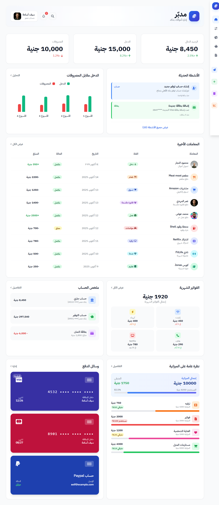
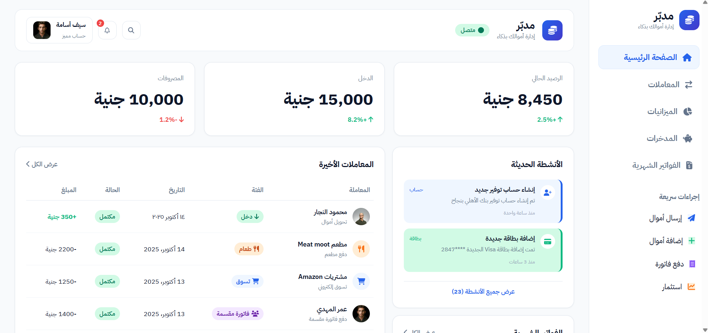
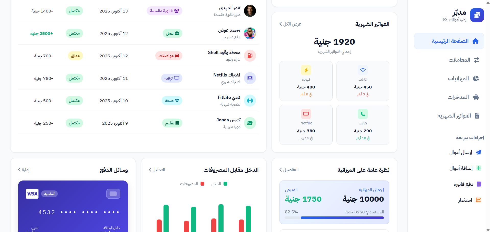
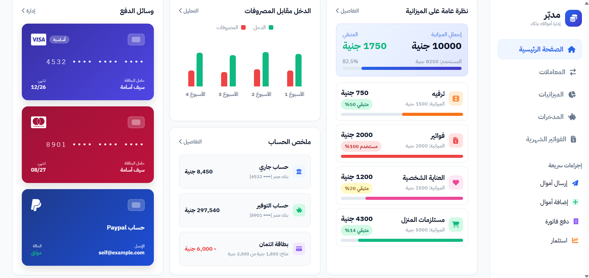
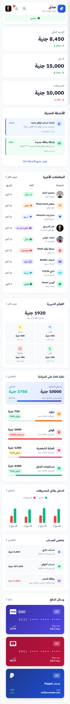

# 💰 Mudabbir (مدبّر) - Personal Financial Dashboard

[](https://mariam-mudabbir-financial-dashboard.vercel.app/)

> **Mudabbir (مدبّر)** — A personal finance management dashboard that helps track expenses, monitor category budgets, analyze weekly income vs expenses, and break the paycheck-to-paycheck cycle. Built using **Pure HTML5**, **CSS3 (CSS Grid & Flexbox)** with zero external CSS frameworks and full **RTL Arabic Support**.
>
> 🌐 **Live Demo**: [https://mariam-mudabbir-financial-dashboard.vercel.app/](https://mariam-mudabbir-financial-dashboard.vercel.app/)

---

## 📸 Screenshots Gallery

### 🖥️ Desktop Dashboard Overview (Full Page)


---

### 🔍 Section Previews (Desktop)

#### 1. Header, Financial Cards & Recent Transactions


#### 2. Monthly Bills & Budget Tracking


#### 3. Income vs. Expenses Chart, 3D Payment Card & Bank Accounts


---

### 📱 Mobile UI & Responsive Layout (Full Page)


---

## 🌟 Key Features

1. **Overall Layout & Off-Canvas Sidebar Navigation**:
   - Clean 2-column grid layout built with pure **CSS Grid** and **Flexbox**.
   - Full **RTL Arabic** support (`dir="rtl"`) with Google Font **IBM Plex Sans Arabic**.
   - Off-canvas mobile menu with backdrop overlay and smooth slide-in toggle animation.

2. **Top Header & Quick Actions**:
   - Search button, notification bell with unread badge counter, live connection status indicator, and user profile card (*سيف أسامة*).

3. **Summary Cards (بطاقات الملخص)**:
   - Real-time financial metrics for **Total Balance** (*8,450 جنية*), **Monthly Income** (*15,000 جنية*), and **Monthly Expenses** (*10,000 جنية*) with percentage trend badges (+2.5%, +8.2%, -1.2%).

4. **Recent Activities & Transactions (المعاملات الأخيرة)**:
   - Complete itemized log featuring all 9 original transaction items with avatars, category badges, dates, status badges, and color-coded amounts (Green for income, Red for expenses).

5. **Monthly Bills Tracker (الفواتير الشهرية)**:
   - Quick glance at upcoming automated utility and subscription payments (*Internet, Electricity, Phone, Netflix*).

6. **Budget Overview (نظرة عامة على الميزانية)**:
   - Category budget tracking bars (*Entertainment, Bills, Personal Care, Home Supplies*) with visual progress fills, percentage caps, and warning indicators.

7. **Income vs. Expenses Chart (الدخل مقابل المصروفات)**:
   - Pure CSS visual bar chart comparing weekly income (Green) vs expenses (Red) across 4 weeks with custom legend indicators.

8. **Payment Methods & 3D Card Animation (وسائل الدفع)**:
   - Interactive 3D flip card animation using pure CSS `perspective: 1000px`, `transform-style: preserve-3d`, `transform: rotateY(180deg)`, and `backface-visibility: hidden`. Supports both mouse hover and mobile touchscreen tap toggling.

9. **Account Summary (ملخص الحساب)**:
   - Comprehensive overview of connected bank accounts (*Primary Checking, Savings Vault, Credit Card Line*).

---

## 🛠️ Technology Stack

- **HTML5**: Semantic markup & RTL text direction (`dir="rtl"`).
- **CSS3**: Pure Vanilla CSS, CSS Grid, Flexbox, 3D Transforms, Responsive Media Queries (Zero Frameworks).
- **Font Awesome 6**: Financial icons and indicators.
- **IBM Plex Sans Arabic**: Clean modern typography.

---

## 🚀 How to Run Locally

1. Clone or download the repository:
   ```bash
   git clone https://github.com/mariammgamall/mudabbir-financial-dashboard.git
   cd mudabbir-financial-dashboard
   ```

2. Open `index.html` directly in any web browser, or start a local HTTP server:
   ```bash
   # Using npx serve
   npx serve .

   # Or using Python HTTP server
   python -m http.server 3000
   ```

3. Navigate to `http://localhost:3000` in your web browser.

---


Clone or download the repository:
   ```bash
   git clone https://github.com/mariammgamall/mudabbir-financial-dashboard.git
   cd mudabbir-financial-dashboard
   ```

2. Open `index.html` directly in any web browser, or start a local HTTP server:
   ```bash
   # Using npx serve
   npx serve .

   # Or using Python HTTP server
   python -m http.server 3000
   ```

3. Navigate to `http://localhost:3000` in your web browser.

---

## 💡 How to Take a Full Size Screenshot in Browsers

If you want to capture a full-page screenshot of the dashboard:

### Google Chrome / Microsoft Edge / Brave:
1. Open the page and press `F12` (or `Ctrl + Shift + I`) to open **Developer Tools**.
2. Press `Ctrl + Shift + P` to bring up the **Command Menu**.
3. Type `Capture full size screenshot` and hit `Enter`.
4. The browser will automatically save a full-length PNG image to your downloads folder.

### Mozilla Firefox:
1. Right-click anywhere on the web page.
2. Select **Take Screenshot** (or press `Ctrl + Shift + S`).
3. Click **Save full page** at the top right corner.
